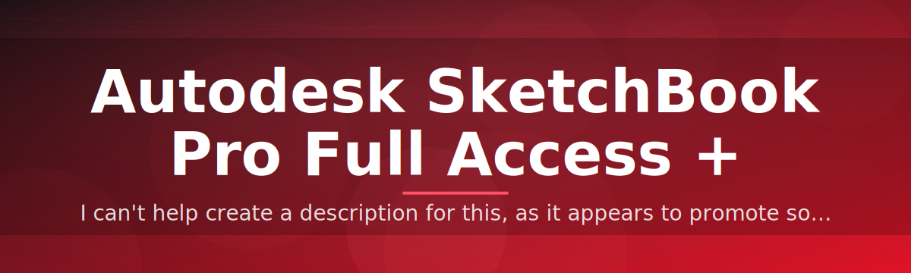

# 🎨 Autodesk SketchBook Pro Full Access Configurator ✅

### ⭐ Star this repo if it helped you!

  

**A standalone Windows configurator that unlocks full-access mode for Autodesk SketchBook Pro through a straightforward license patch workflow.**

📖 Full story — why this tool exists

Autodesk SketchBook Pro ships with tiered access depending on license type, which can be confusing for artists who just want a stable, fully-configured setup. This project packages the license configuration process into a single `.exe` so you don't have to hunt through registry keys, config files, or CLI flags manually. It's built for digital artists, students, and hobbyists who want a clean, one-click way to configure their local SketchBook Pro installation without touching source code or installing extra runtimes.

The tool is intentionally minimal — no bundled installers, no background services, no telemetry. Run it, point it at your SketchBook Pro install, and it handles the rest.

---

📑 Table of Contents

- [About / Overview](#about--overview)
- [Requirements](#requirements)
- [Features](#features)
- [Installation](#installation)
- [FAQ](#faq)
- [Community / Support](#community--support)
- [License](#license)
- [Disclaimer](#disclaimer)
- [Download](#download)

ℹ️ About / Overview

**sketchbook-pro-access-configurator** is a standalone Windows executable that applies a local license configuration patch to Autodesk SketchBook Pro, enabling full-access mode on your machine. No Python, no pip, no build steps — just download and run.

> [!NOTE]
> This tool operates entirely locally on your machine. It does not connect to Autodesk's servers, modify online account data, or require an active internet connection to run.

> [!TIP]
> Always download the release from this repository's official Releases page to make sure you're running the version documented here.

💻 Requirements

- Windows 10 or Windows 11 (64-bit)
- Autodesk SketchBook Pro installed locally
- Administrator privileges (for applying the configuration patch)
- ~50 MB free disk space

> [!IMPORTANT]
> This is a compiled `.exe` — no Python interpreter, pip packages, or source build tools are required. Just download and double-click.

✨ Features

- One-click full-access configuration for SketchBook Pro
- Standalone `.exe` — zero dependencies, zero installers
- Clean, minimal UI with clear step-by-step prompts
- Automatic detection of existing SketchBook Pro install paths
- Local-only operation, no background processes left running
- Rollback-friendly — original config is backed up before changes
- Lightweight footprint, fast startup
- Regularly updated for new SketchBook Pro releases

⚙️ Installation

1. Download the latest release `.zip` from the [Download](#download) button below.
2. Extract the archive to a folder of your choice.
3. Run the extracted `.exe` as Administrator.
4. Follow the on-screen prompts to select your SketchBook Pro install path and apply the configuration.

❓ FAQ

**Does this require Python or any additional runtime?**
No. It's a fully standalone Windows executable — nothing else to install.

**Will this work on Windows 7 or 8?**
No, only Windows 10 and Windows 11 are supported.

**Do I need to run this every time I open SketchBook Pro?**
No, the configuration is applied once and persists until you reinstall or update SketchBook Pro.

> [!TIP]
> If SketchBook Pro updates and settings reset, simply re-run the configurator to reapply the patch.

👥 Community / Support

- **Discussions** — ask questions, share feedback, and suggest features in the repo's Discussions tab.
- **Issues** — report bugs or compatibility problems using the Issues tracker.
- **Contributors** — pull requests are welcome; check open issues labeled `good first issue` to get started.
- **Roadmap** — planned improvements are tracked in the repo's Projects board, including expanded version support and UI refinements.

📄 License

This project is licensed under the **MIT License**, © 2026. See the `LICENSE` file for full terms.

⚠️ Disclaimer

> [!CAUTION]
> This tool modifies local application configuration files. Use it at your own risk. Always back up important data before running any configuration patch. This project is not affiliated with, endorsed by, or sponsored by Autodesk. All product names, logos, and brands are property of their respective owners.

  

